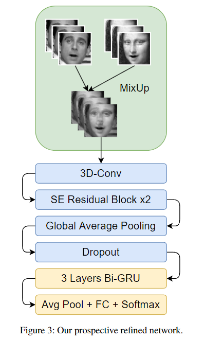

# mimicry

Preprint DOI: `10.5281/zenodo.10826306`

<table >
<tr>
</tr>
<tr>
<td width="40% style="text-align: center;">

<!--  -->
</td>
<td width="60%>

Title: **Automated Lip Reading from Video Dataset with 3D Convolutional Neural Network**

Abstract: Lip reading from videos or images using deep learning-based solutions is becoming increasingly necessary to solve a variety of tasks, especially for physically challenged people. As the world's sixth most widely spoken language, Bengali (Bangla) is still far behind other languages in terms of technological progress. In this work,  using video data we produced (in preparation), we attempt to find a solution to solve the lip-reading problem in Bengali using a 3D Convolutional Neural Network (3D-CNN). 
So far, we are testing different Machine Learning (ML) and Deep Learning (DL) based models’ performance from a private synthetic dataset (English) that we will publish soon. 

</td>
</tr>
</table>

